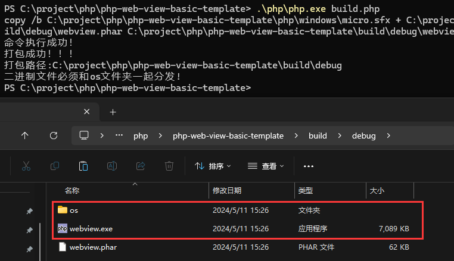
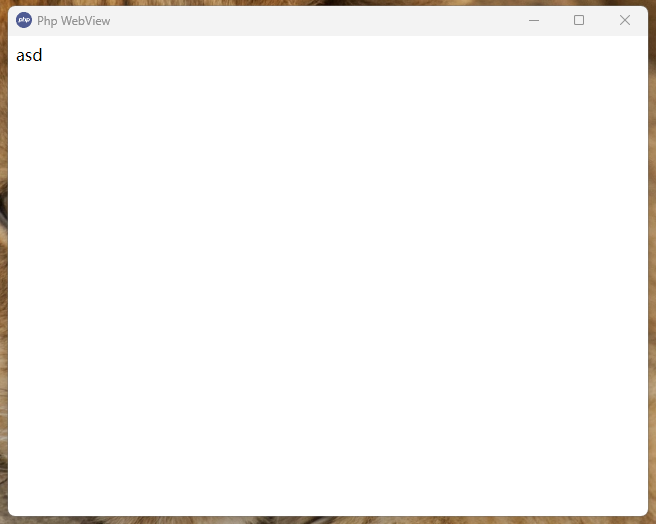
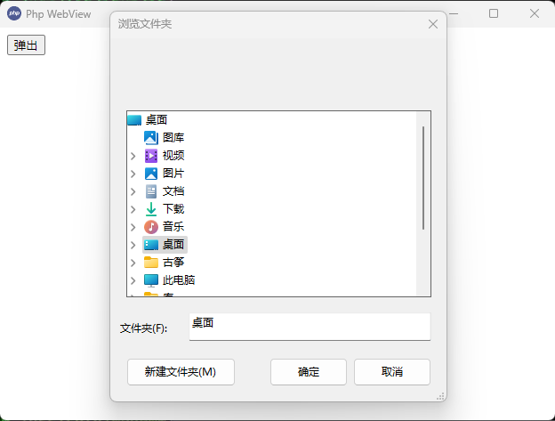
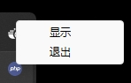

# Php-webview-desktop

php based on webview2 development windows desktop, js and php directly interact

It is currently only available for windows

```
directory structure
.
├── os\               System expansion catalog
|   
├── php\              php environment directory
|   
├── src\              Application directory
|   └── index.php     Entry file (file name does not change)
|
├── favicon.ico       document icon
|
├── build.php         compiling file
|
└── windows.bat       windows run file
```

## update
**Enter the src directory**

run command `..\php\php.exe ..\php\composer.phar update` update

Own php environment `php composer update` update

## run
**Enter the root directory**

Double-click `windows.bat` or run the command `.\php\php.exe src/index.php` to start

Start your own php environment `php src/index.php` (ffi extension and phar extension must be enabled)

## build
**Enter the root directory**

Run the command `.\php\php.exe build.php` or run `php build.php` in your own php environment



Since the previous compression compilation will report poison, now cancel, after compiling 25M base

### More build instructions

`-debug` `-name=xxx`

```shell
.\php\php.exe build.php -debug  # debug
.\php\php.exe build.php -name=myapp  # filename is myapp 
```

## result


## document icon

**Tip** The file icon must be in the boot directory, otherwise it will not be displayed

## course

config

```php

use KingBes\PhpWebview\WebView;
use KingBes\PhpWebview\WindowSizeHint;

/**
 * @param string $title window title
 * @param int $width Window width
 * @param int $height Window height
 * @param bool $debug debug default：false
 * __DIR__ entrance location
 */
$webview = new WebView('Php WebView', 640, 480, true, __DIR__);
```

Get and set

```php
// get ffi          return：FFI
$webview->getFFI();
// get webview      return：mixed
$webview->getWebview();
// get window title     return：string
$webview->getTitle();
// set window title     param：title=string
$webview->setTitle(title:"New title");
// get Window width     return：int
$webview->getWidth();
// set Window width     param：width=int
$webview->setWidth(width:100);
// get Window height     return：int
$webview->getHeight();
// set Window height     param：height=int
$webview->setHeight(height:100);
// get hint  return：int
$webview->getHint();
// set hint  param：hint=WindowSizeHint::HINT_MIN
$webview->setHint(hint:WindowSizeHint::HINT_MIN);
// Modify window size  param:width=int height=int hint=WindowSizeHint ：HINT_NONE; HINT_MIN; HINT_MAX; HINT_FIXED
$webview->size(int $width, int $height, WindowSizeHint $hint);
// debug    return：bool
$webview->isDebug();
// set html     param：html=string
$webview->setHTML(html:"<a>html content</a>");
// Bind interactive operations    param：name=string ，Closure function：$req is param,$seq is trigger number
$webview->bind(name:"bindName",function($seq, $req, $context){
    return ["return content","return array"];
});
// remove binding param：name string
$webview->unbind(name:"bindName");
// set navigate  param：url=string
$webview->navigate(url:"http://www.baidu.com");
// Taskbar icon title
$webview->icon_title('php WeView');
// Taskbar icon menu param：arr = array ,Take a look at example four
$webview->icon_menu(arr:$arr);
// show windows
$webview->show_win();
// Exit window
$webview->destroy_win();
// run
$webview->run();
// destroy
$webview->destroy();
```

### Example 1 `js and php interaction`

```php

require_once "vendor/autoload.php";

use KingBes\PhpWebview\WebView;

$webview = new WebView('Php WebView', 640, 480, true, __DIR__);

$html = <<<EOF
<button onclick="onBtn()">click</button>
<script>
    function onBtn(){
        let msg = "hello php"
        btn(msg).then(function (data) {
            alert(data)
        })
    }
</script>

EOF;

$webview->setHTML($html);

$webview->bind('btn', function ($seq, $req, $context) {
    return $req;
});

$webview->run();

$webview->destroy();

```

### Example 2 `Setting up local static files`

```php
require_once "vendor/autoload.php";

use KingBes\PhpWebview\WebView;

$webview = new WebView('Php WebView', 640, 480, true, __DIR__);
// Local file `index.html`
$pharPath = \Phar::running(false);
if ($pharPath != "") {
    // Obtain the path after build
    $url = dirname($pharPath) . "/index.html";
} else {
    // No path to get after build
    $url = dirname(__DIR__)  . "/index.html";
}
$webview->navigate($url);

$webview->navigate($navigate);

$webview->run();

$webview->destroy();

```

### Example 3 'Pop-up dialog box'

```php
require_once "vendor/autoload.php";

use KingBes\PhpWebview\WebView;
use KingBes\PhpWebview\Dialog;

// dialog box
$dialog = new Dialog(__DIR__);

$webview = new WebView('Php WebView', 640, 480, true, __DIR__);

$html = <<<EOF
<button onclick="onMsg('hello php',2)">Dialog</button>
<script>
    function onMsg(str,num){
        openMsg(str,num).then(function (data){
            console.log(data)
        })
    }
</script>

EOF;

$webview->setHTML($html);

$webview->bind('openMsg', function ($seq, $req, $context) use ($dialog) {
    // show msg
    $msg = $dialog->msg($req[0], $req[1]);
    return ["code" => 0, "msg" => $msg];
});

$webview->run();

$webview->destroy();
```

#### Dialog function

config

```php
require_once "vendor/autoload.php";
use KingBes\PhpWebview\Dialog;

 // __DIR__ entrance location
$dialog = new Dialog(__DIR__);
```

function

```php
// msg param：str=>string , type=>int (0~2) return: bool
$dialog->msg(str:"hello php",type:0);
// prompt return：string
$dialog->prompt();
// file return：string ;Note: Return the selected file path string, do not select to return an empty string
$dialog->file();
// dir param： dirs=>string (Initializes the folder path. If empty, the default path)  return：string ;Return the selected folder path string, do not select to return an empty string
$dialog->dir(dirs:"D:/");
// save file param：content=>string (Saved content) filename=>string path=>string (Initializes the folder path, which is empty by default)  return：bool
$dialog->save(content:"hello",filename:"test.txt",path:"D:/");
```

result



### Example 4 `Taskbar icon menu`

```php
// The taskbar menu field name is the menu `name` field `fn` is the function that is triggered when clicked
$arr = [
    ["name" => "show", "fn" => function () use ($webview) {
        // 显示窗口
        $webview->show_win();
    }],
    ["name" => "exit", "fn" => function () use ($webview) {
        // 退出窗口
        $webview->destroy_win();
    }]
];
$webview->icon_menu($arr);
```

result



# php-webview Linux Desktop

expand [webview.so](https://github.com/KingBes/php-webview-expand) test-in-process

# correlation

[webview](https://github.com/webview/webview) [php-webview](https://github.com/0hr/php-webview) [dialog](https://github.com/ttytm/dialog) [static-php-cli](https://github.com/crazywhalecc/static-php-cli)

[Package as an installation package](https://jrsoftware.org/isinfo.php)