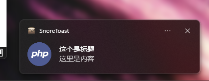

# php-webview

```
目录结构
.
|   
├── php\              php环境目录
|   
├── src\              应用目录
|   └── index.php     入口文件(文件名别修改)
|
├── favicon.ico       文件图标
|
└── windows.bat       windows运行文件
```

### 更新
**进入src目录**

```shell
..\php\php.exe ..\php\composer.phar require kingbes/framework
```

自己composer环境

```shell
composer require kingbes/framework
```

### 运行
**进入根目录**

双击 `windows.bat` 或者运行命令 `.\php\php.exe src/index.php` 启动

自己php环境 `php src/index.php` 启动 (必须开启ffi拓展和phar拓展)

### 编译
**进入根目录**

运行命令 `.\php\php.exe build.php` 或者自己php环境运行 `php build.php`


由于之前压缩编译会报毒，现在取消，编译后25M打底

#### 更多编译指令

`-debug` `-name=xxx` `-exclude="\xxx"`

```shell
.\php\php.exe build.php -debug  # 编译为debug
.\php\php.exe build.php -name=myapp  # 文件名为 myapp 
.\php\php.exe build.php -exclude="\view"  # 忽略文件夹view 批量忽略:-exclude="\view,\asd\123.txt,..."
```

### 效果


#### 文件图标
**提示** 文件图标必须在启动目录下，不然不显示

# 教程

配置

```php
/**
 * 自由加载 function
 *
 * @param [type] $class
 * @return void
 */
function Autoloader($class): void
{
    $baseDirectory = __DIR__;
    $file = $baseDirectory . DIRECTORY_SEPARATOR . str_replace('\\', '/', $class) . '.php';
    if (file_exists($file)) {
        require_once $file;
    }
}

// 注册
spl_autoload_register('Autoloader');

use KingBes\PhpWebview\WebView;
use KingBes\PhpWebview\WindowSizeHint;

/**
 * @param string $title 窗口标题
 * @param int $width 窗口宽度
 * @param int $height 窗口高度
 * @param bool $debug debug模式 默认：false
 */
$webview = new WebView('Php WebView', 640, 480, true);
```

获取与设置

```php
// 获取ffi          返回：FFI
$webview->getFFI();
// 获取webview      返回：mixed
$webview->getWebview();
// 获取窗口标题     返回：string
$webview->getTitle();
// 设置窗口标题     参数：title=string
$webview->setTitle(title:"新的标题");
// 获取窗口宽度     返回：int
$webview->getWidth();
// 设置窗口宽度     参数：width=int
$webview->setWidth(width:100);
// 获取窗口高度     返回：int
$webview->getHeight();
// 设置窗口高度     参数：height=int
$webview->setHeight(height:100);
// 获取窗口大小提示  返回：int
$webview->getHint();
// 设置窗口大小提示  参数：hint=WindowSizeHint::HINT_MIN
$webview->setHint(hint:WindowSizeHint::HINT_MIN);
// 修改窗口大小  参数 width=int height=int hint=WindowSizeHint ：HINT_NONE 自由缩放 HINT_MIN 固定最小 HINT_MAX 固定最大 HINT_FIXED 禁止缩放
$webview->size(int $width, int $height, WindowSizeHint $hint);
// 判断是否debug    返回：bool
$webview->isDebug();
// 设置html内容     参数：html=string
$webview->setHTML(html:"<a>html的内容</a>");
// 绑定交互的操作    参数：name=string ，闭包函数：$req 是接收到的参数,$seq 是触发次数
$webview->bind(name:"bindName",function($seq, $req, $context){
    return ["返回内容","返回数组"];
});
// 解除绑定         参数：name=你绑定过的name名
$webview->unbind(name:"bindName");
// 设置窗口url内容  参数：url=string
$webview->navigate(url:"http://www.baidu.com");
// 任务栏图标标题
$webview->icon_title('php WeView');
// 任务栏图标菜单 参数：arr = array ,具体看 示例四
$webview->icon_menu(arr:$arr);
// 显示窗口
$webview->show_win();
// 退出窗口
$webview->destroy_win();
// 运行
$webview->run();
// 销毁
$webview->destroy();
```

## 示例一 `js和php交互`

```php

use KingBes\PhpWebview\WebView;

// 实例
$webview = new WebView('Php WebView', 640, 480, true);

$html = <<<EOF
<button onclick="onBtn()">点击</button>
<script>
    function onBtn(){
        let msg = "hello php"
        btn(msg).then(function (data) {
            alert(data)
        })
    }
</script>

EOF;

// 设置HTML
$webview->setHTML($html);
// 绑定
$webview->bind('btn', function ($seq, $req, $context) {
    return $req;
});
// 运行
$webview->run();
// 销毁
$webview->destroy();

```

## 示例二 `设置本地静态文件`

```php

use KingBes\PhpWebview\WebView;

// 实例
$webview = new WebView('Php WebView', 640, 480, true);
// 本地文件`index.html`
$url = __DIR__ . DIRECTORY_SEPARATOR . 'view' . DIRECTORY_SEPARATOR . 'index.html';
$webview->navigate($url);
// 设置url
$webview->navigate($navigate);
// 运行
$webview->run();
// 销毁
$webview->destroy();

```

## 示例三 `弹出对话框`

```php

use KingBes\PhpWebview\WebView;
use KingBes\PhpWebview\Dialog;

// 对话实例  
$dialog = new Dialog();

// webview实例
$webview = new WebView('Php WebView', 640, 480, true);
// 获取html
$html = <<<EOF
<button onclick="onMsg('hello php',2)">弹出</button>
<script>
    function onMsg(str,num){
        openMsg(str,num).then(function (data){
            console.log(data)
        })
    }
</script>

EOF;
// 设置HTML
$webview->setHTML($html);
// 绑定
$webview->bind('openMsg', function ($seq, $req, $context) use ($dialog) {
    // 弹出消息窗口
    $msg = $dialog->msg($req[0], $req[1]);
    return ["code" => 0, "msg" => $msg];
});
// 运行
$webview->run();
// 销毁
$webview->destroy();
```

对话框功能

配置

```php

use KingBes\PhpWebview\Dialog;

$dialog = new Dialog();
```

功能

```php
// 消息框 参数：str=>string , type=>int (0~2) 返回: bool
$dialog->msg(str:"hello php",type:0);
// 输入框 返回：string
$dialog->prompt();
// 文件框 返回：string  说明：返回选择的文件路径字符串，不选择返回空字符串
$dialog->file();
// 文件夹框 参数： dirs=>string (初始化文件夹路径,为空则默认路径)  返回：string  说明：返回选择的文件夹路径字符串，不选择返回空字符串
$dialog->dir(dirs:"D:/");
// 保存文件 参数：content=>string (保存的内容) filename=>string (保存的文件名) path=>string (初始化文件夹路径，默认为空)  返回：bool
$dialog->save(content:"你好",filename:"test.txt",path:"D:/");
```

效果


## 示例四 `任务栏图标菜单`

```php
// 任务栏菜单 字段name是菜单名称  字段fn是点击后触发的函数
$arr = [
    ["name" => "显示", "fn" => function () use ($webview) {
        // 显示窗口
        $webview->show_win();
    }],
    ["name" => "退出", "fn" => function () use ($webview) {
        // 退出窗口
        $webview->destroy_win();
    }]
];
$webview->icon_menu($arr);
```

效果


## 实例五 `弹出吐司消息`

```php
use KingBes\PhpWebview\Toast;

$toast = new Toast();

$show = $toast->Instance_Create()
    ->setAppName("toast")
    ->setAppUserModelId()
    ->setShortcutPolicy(0)
    ->initialize()
    ->Template_Create(4)
    ->Template_setFirstLine("php toast")
    ->showToast();

sleep(3);

$show->DestroyToast();
```

功能

```php
/**
 * 获取ffi function
 *
 * @return \FFI
 */
public function getFFi(): \FFI
{}

/**
 * 是否兼容 function
 *
 * @return int
 */
public function isCompatible(): int
{}

/**
 * 创建接口实例 function
 *
 * @return self
 */
public function Instance_Create(): self
{}

/**
 * 设置app名称 function
 *
 * @param string $str
 * @return self
 */
public function setAppName(string $str): self
{}

/**
 * 设置app用户模块id function
 *
 * @param string $modeId 模块id
 * @return self
 */
public function setAppUserModelId(string $modeId = "Microsoft.Windows.Explorer"): self
{}

/**
 * 设置快捷方式的政策 function
 *
 * @param integer $num 0=>忽略快捷策略,1=>无需创建快捷策略,2=>快捷策略需要创建
 * @return self
 */
public function setShortcutPolicy(int $num = 0): self
{}

/**
 * 创建快捷方式 function
 *
 * @return self
 */
public function createShortcut(): self
{}

/**
 * 初始化 function
 *
 * @return self
 */
public function initialize(): self
{}

/**
 * 创建模板 function
 *
 * @param integer $type 
 * 0=>TemplateType_ImageAndText01
 * 
 * 1=>TemplateType_ImageAndText02
 * 
 * 2=>TemplateType_ImageAndText03
 * 
 * 3=>TemplateType_ImageAndText04
 * 
 * 4=>TemplateType_Text01
 * 
 * 5=>TemplateType_Text02
 * 
 * 6=>TemplateType_Text03
 * 
 * 7=>TemplateType_Text04
 * @return self
 */
public function Template_Create(int $type): self
{}

/**
 * 模板设置第一行内容 function
 *
 * @param string $str
 * @return self
 */
public function Template_setFirstLine(string $str): self
{}

/**
 * 显示吐司 function
 *
 * @return mixed
 */
public function showToast(): mixed
{}

/**
 * 模板设置第二行内容 function
 *
 * @param string $str
 * @return self
 */
public function Template_setSecondLine(string $str): self
{}

/**
 * 模板设置第三行内容 function
 *
 * @param string $str
 * @return self
 */
public function Template_setThirdLine(string $str): self
{}

/**
 * 模板设置文本字段 function
 *
 * @param string $str
 * @param integer $pos
 * 0=>第一行
 * 
 * 1=>第二行
 * 
 * 2=>第三行
 * @return self
 */
public function Template_setTextField(string $str, int $pos): self
{}

/**
 * 模板设置属性文本 function
 *
 * @param string $str
 * @return self
 */
public function Template_setAttributionText(string $str): self
{}

/**
 * 模板设置图片路径 function
 *
 * @param string $path 图像路径
 * @return self
 */
public function Template_setImagePath(string $path): self
{}

/**
 * 模板设置图像路径与裁剪提示 function
 *
 * @param string $path 图像路径
 * @param integer $CropHint
 * 0=>裁剪提示方块
 * 
 * 1=>裁剪提示圈
 * @return self
 */
public function Template_setImagePathWithCropHint(string $path, int $CropHint): self
{}

/**
 * 模板设置英雄图像路径 function
 *
 * @param string $path 图像路径
 * @param boolean $inlineImage 位置
 * @return self
 */
public function Template_setHeroImagePath(string $path, bool $inlineImage): self
{}

/**
 * 模板设置音频系统文件 function
 *
 * @param integer $audio 0~25
 * @return self
 */
public function Template_setAudioSystemFile(int $audio): self
{}

/**
 * 模板设置音频路径 function
 *
 * @param string $audioPath 音频路径
 * @return self
 */
public function Template_setAudioPath(string $audioPath): self
{}

/**
 * 模板设置音频选项 function
 *
 * @param integer $audioOption 
 * 0=>TextField_FirstLine
 * 
 * 1=>TextField_SecondLine
 * 
 * 2=>TextField_ThirdLine
 * @return self
 */
public function Template_setAudioOption(int $audioOption): self
{}

/**
 * 设置模板时间 function
 *
 * @param integer $duration 0~2
 * 0=>Duration_System
 * 
 * 1=>Duration_Short
 * 
 * 2=>Duration_Long
 * @return self
 */
public function Template_setDuration(int $duration): self
{}

/**
 * 模板设置过期 function
 *
 * @param integer $millisecondsFromNow
 * @return self
 */
public function Template_setExpiration(int $millisecondsFromNow): self
{}

/**
 * 模板设置场景 function
 *
 * @param integer $scenario 0~3
 * 0=>Scenario_Default
 * 
 * 1=>Scenario_Alarm
 * 
 * 2=>Scenario_IncomingCall
 * 
 * 3=>Scenario_Reminder
 * @return self
 */
public function Template_setScenario(int $scenario): self
{}

/**
 * 添加操作 function
 *
 * @param string $label
 * @return self
 */
public function Template_addAction(string $label): self
{}


/**
 * 模板是否过期 function
 *
 * @return integer
 */
public function Template_expiration(): int
{}

/**
 * 消除 function
 *
 * @return void
 */
public function DestroyToast(): void
{}
```

效果


[参考](https://github.com/AlienCowEatCake/WinToastLibC)
[更多](https://github.com/mohabouje/WinToast)

## 互补项目

### jolinotif 

地址：[GITHUB](https://github.com/jolicode/JoliNotif)

```shell
..\php\php.exe ..\php\composer.phar require "jolicode/jolinotif"
```

自己环境

```shell
composer require "jolicode/jolinotif"
```

#### 示例

```php

require "vendor/autoload.php";
use Joli\JoliNotif\Notification;
use Joli\JoliNotif\DefaultNotifier;

$notifier = new DefaultNotifier();

// 此处忽略....

// 不太建议绑定来触发,只是演示功能
$webview->bind('jolinotif', function ($seq, $req, $context) use ($notifier) {
    $notification = (new Notification())
        ->setTitle('这个是标题')
        ->setBody('这里是内容')
        ->setIcon("xxx/favicon.ico"); // 这个是图标
    $res = $notifier->send($notification); //发送
    return ["code" => 0, "msg" => $res];
});
```

问题：编译release后就不能使用了，最好编译时忽略 jolinotif的相关vendor(或许我之后研究一下比较适合)




# webman-webview 套壳桌面版

[码云](https://gitee.com/kllxs_admin/webview-jacketing)

# php-webview Linux桌面

拓展 [webview.so](https://github.com/KingBes/php-webview-expand) 鸡肋版

# 相关

[webview](https://github.com/webview/webview) [php-webview](https://github.com/0hr/php-webview) [dialog](https://github.com/ttytm/dialog) [static-php-cli](https://github.com/crazywhalecc/static-php-cli)

[打包为安装包](https://jrsoftware.org/isinfo.php)